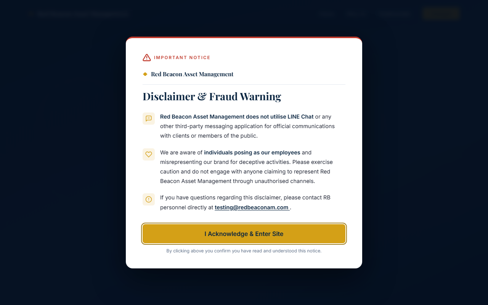

# Red Beacon Asset Management

A static one-page marketing website for **Red Beacon Asset Management** — a Singapore-based wealth management firm. Clean Modern design with warm cream palette, split-layout hero, animated statistics, testimonial carousel, and an async contact form.

**Live site:** [https://willy821.github.io/asset-management](https://willy821.github.io/asset-management)



---

## Features

| Section | Description |
|---------|-------------|
| **Disclaimer Gate** | Modal overlay on every visit with fraud warning; focus-trapped, keyboard-accessible |
| **Sticky Navbar** | Transparent over hero, transitions to solid white on scroll; hamburger drawer on mobile |
| **Hero** | Split layout — headline/CTAs left, decorative performance card visual right; animated stat counters |
| **Why Choose Us** | Four feature cards with staggered scroll-reveal and gold bottom-accent hover effect |
| **Testimonials** | Auto-rotating carousel with touch/swipe support, dot indicators, and pause-on-hover |
| **Contact Form** | Async FormSubmit.co delivery, inline field validation, loading spinner, success/error feedback |
| **Footer** | Brand, quick links, services, legal columns; social icons; risk disclosure |
| **WhatsApp Chatbot** | Star Wars themed floating button (bottom-left); pulse ring, Yoda tooltip, pre-filled message, mobile-responsive |

---

## Project Structure

| File | Role |
|------|------|
| `index.html` | All markup. Sections: `#home` (hero), `#why-us` (USP cards), `#testimonials` (carousel), `#contact` (form), footer |
| `styles.css` | All styling. CSS custom properties in `:root`. Physical CSS properties only (no logical properties) |
| `script.js` | All interactivity — navbar scroll, hamburger, smooth scroll, IntersectionObserver scroll-reveal, stat counters, carousel, form validation + async submission |

---

## Running Locally

No build step required. Open `index.html` directly in any browser:

```powershell
Start-Process "index.html"
```

Or double-click `index.html` in File Explorer.

---

## Form Setup

The contact form uses [FormSubmit.co](https://formsubmit.co) for email delivery (no backend required).

- Recipient: `lunpin.hon@redbeaconam.com`
- **First submission** triggers a one-time confirmation email — click the link to activate the endpoint.

---

## Design

**Palette (Clean Modern — light theme)**

| Token | Value | Use |
|-------|-------|-----|
| `--cream` | `#fafaf8` | Page base |
| `--cream-2` | `#f2ebe0` | Alt section background |
| `--navy` | `#1a2f5e` | Primary / text / nav |
| `--navy-dark` | `#0f1d3a` | Footer |
| `--gold` | `#c9a84c` | Accent |

**Fonts:** Playfair Display (headings) · Inter (body)  
**Breakpoints:** 1024 px (tablet) · 768 px (mobile) · 480 px (small phone)

---

## Contact

For enquiries: lunpin.hon@redbeaconam.com
